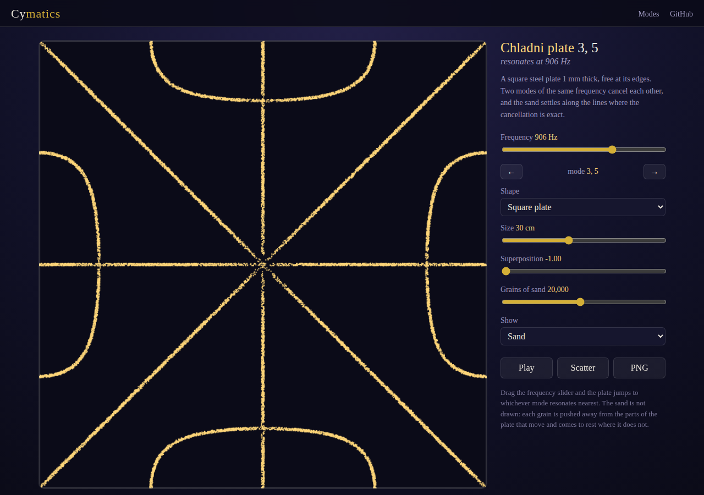
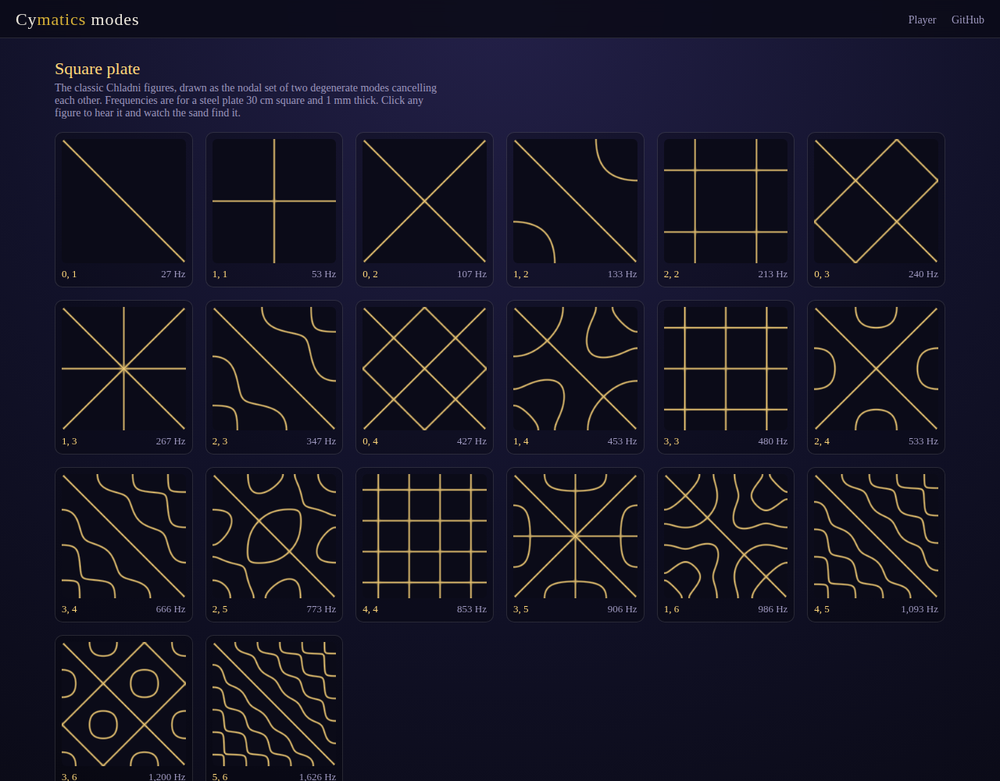

# Cymatics

Play a frequency and watch the sand settle into its Chladni figure. Everything on the page — the plate, the sand, and the tone — is computed from the wave equation in the browser. No libraries, no images, no tables.

- [Play a frequency](https://evoluteur.github.io/cymatics/)
- [Browse the modes](https://evoluteur.github.io/cymatics/modes.html)





## What it does

Drag the frequency slider and the plate jumps to whichever mode resonates nearest, plays that tone, and lets the sand find the figure. Two plates are available:

- a **square steel plate** 1 mm thick, free at its edges — the plate Chladni himself bowed;
- a **drumhead**, an ideal circular membrane fixed at its rim.

The sand is a particle simulation, not a drawing. Each grain measures how far it is from the nearest nodal line, walks downhill, and is thrown about in proportion to how much the plate moves under it. It comes to rest where the plate does not move, which is exactly what sand does on a real plate.

Every grain is drawn on a plain 2D `<canvas>` - no WebGL required.

## The mathematics

The square plate's figures are the zero set of

```
cos(n·πx)·cos(m·πy) − cos(m·πx)·cos(n·πy)
```

two modes of the same frequency, superposed so that they cancel. The **Superposition** slider sweeps that cancellation from one mode to the other, which is why a single frequency can show a family of figures.

The drumhead's modes are Bessel functions, `Jₙ(α·r)·cos(n·θ)`, giving *n* nodal diameters and *s* nodal circles. The Bessel functions are computed from their own series and their zeros are found by scanning for sign changes and bisecting, so no table of zeros is needed.

The frequencies are the real ones for these idealised objects. A stiff plate obeys a fourth-order equation and rings in proportion to `m² + n²`; a membrane has tension but no stiffness and rings in proportion to the Bessel zero itself. Both are derived from the material constants at the top of [js/cymatics.js](https://github.com/evoluteur/cymatics/blob/main/js/cymatics.js):

```js
const PLATE = {
  young: 200e9, // Pa, steel
  density: 7850, // kg/m3
  poisson: 0.3,
  thickness: 0.001, // m
};
const MEMBRANE = {
  speed: 100, // m/s, wave speed of the stretched skin
};
```

A real plate of brass or glass, with its own thickness, mounting, and imperfections, will not match these numbers exactly. The shapes are the honest part; the frequencies are those of the model.

## Ernst Chladni

Ernst Chladni sprinkled sand on a metal plate and drew a violin bow along its edge. At most speeds nothing happened. At certain ones the plate rang and the sand fled the moving parts to gather along the lines that stood still. He published the figures in *Entdeckungen über die Theorie des Klanges* and toured Europe demonstrating them, giving acoustics its first pictures. Napoleon saw the demonstration in Paris and had the Institut de France offer a prize to whoever could explain the figures mathematically. Sophie Germain won it in 1816, on her third attempt, with the first theory of elastic surfaces.

Cymatics is open source at [GitHub](https://github.com/evoluteur/cymatics) with MIT license.

If you like frequencies, see also my other projects [Healing-Frequencies](https://github.com/evoluteur/healing-frequencies) ([demo](https://evoluteur.github.io/healing-frequencies/)) and [Binaural-Beats](https://github.com/evoluteur/binaural-beats) ([demo](https://evoluteur.github.io/binaural-beats/)). If you like figures made of circles and lines, see [Sacred-Geometry](https://github.com/evoluteur/sacred-geometry) ([demo](https://evoluteur.github.io/sacred-geometry/)), [Platonic-Solids](https://github.com/evoluteur/platonic-solids) ([demo](https://evoluteur.github.io/platonic-solids/)), and [Archimedean-Solids](https://github.com/evoluteur/archimedean-solids) ([demo](https://evoluteur.github.io/archimedean-solids/)).

Copyright (c) 2026 [Olivier Giulieri](https://evoluteur.github.io/).
